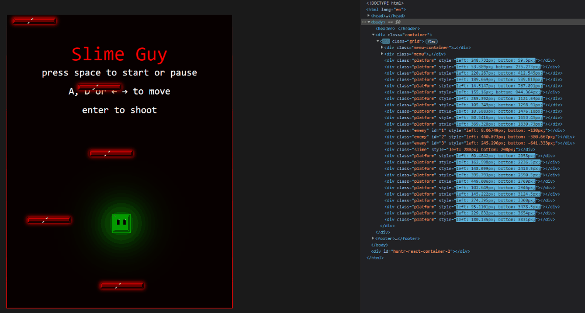
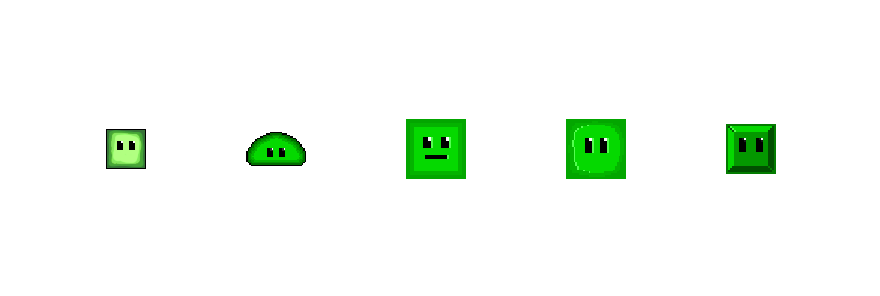

# [Slime Guy](https://jflec.github.io/Slime-Guy/)


# Background

Slime Guy throws the user straight into slime action. After committing countless horrendous crimes against humanity, Slime Guy was banished to the deepest darkest depths of Hell. It is up to the player to decide if Slime Guy survives and redeems himself, otherwise Slime Guy more like Slime Die.

# Technologies

  * JavaScript
  * HTML
  * CSS

  

  From the beginning of the project I wanted to be able to style every asset in my game using CSS, with that in mind everything you see on the screen is a div. The above GIF shows what's going on behind the scenes and allows you to see the game update live.

# Code Snippet

 ```javascript
 function updateEnemys(enemy, grid) {
  if (!gameOver) {
    let scoreStyle = document.querySelector('.score');
    if (enemy.bottom >= grid.clientHeight) {
      if (!enemy.killed) {
        grid.style.transform = 'scale(1.06)';
        grid.style.boxShadow = 'inset 0px 11px 20px -10px rgb(94, 0, 0)';
        scoreStyle.style.color = 'red';
        scoreStyle.style.transform = 'scale(1.06)';
        let enemyStyle = document.getElementById(enemy.visual.id);
        enemyStyle.style.transition = '0.2s';
        enemyStyle.style.boxShadow = '0px 0px 100px 40px rgb(94, 0, 0)';
        grid.style.border = '4px solid red';
      }
    }
    if (enemy.bottom >= grid.clientHeight + 20) {
      let firstEnemy = enemys[0].visual;
      if (!enemy.killed) {
        grid.style.transform = 'scale(1.0)';
        grid.style.boxShadow = 'inset 0px 0px 0px 0px rgb(94, 0, 0)';
        scoreStyle.style.color = 'white';
        scoreStyle.style.transform = 'scale(1.0)';
        grid.style.border = '2px solid red';
        grid.style.borderImage =
          'linear-gradient(0deg, rgb(255, 0, 0), rgb(26, 26, 26)) 1';
        global.score -= 20;
      }
      firstEnemy.remove();
      enemys.shift();
      let newEnemy = new Enemy(grid, -50);
      enemys.push(newEnemy);
    }
  }
}
 ```
 
 This snippet is in charge of adding new enemies to the screen, and creating a cool visual effect when an enemy escapes. Because all of my assets are divs I was able to add CSS styling like box shadows. It's a subtle addition to the project, however, I think it adds an interesting dyanmic to the whole user experience. 

# Wireframe 


# Evolution of Slime Guy



# Functionality

Users will be able to:
  * Ascend to randomly placed platforms using their arrow keys and or WASD.
  * Pause and play.
  * Shoot enemies for extra points.

This project will also include:
  * An About modal describing the background and rules of the game
  * A production README
  
# Implementation Timeline

* 8/15/21 - Finish working on assets, and game concept art.
* 8/16/21 - Start adding game logic, player movement and platform generation.
* 8/17/21 - Potentially add enemies and loss condition. 
* 8/18/21 - Add in final details.
* 8/19/21 - Any left over work needed.
