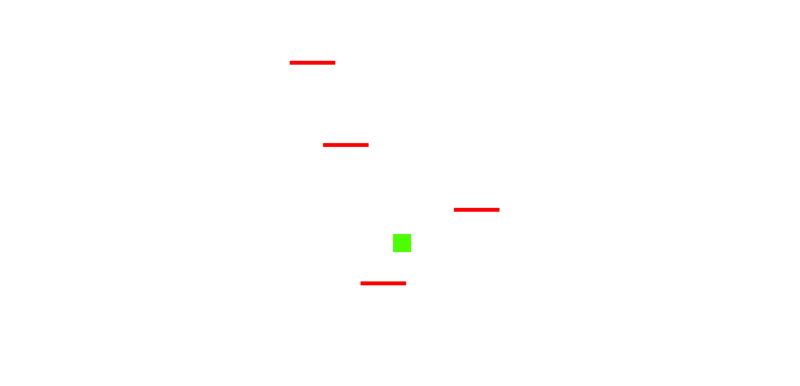

# Background

Slime Guy throws the user straight into slime action. After committing countless horrendous crimes against humanity, Slime Guy was banished to the deepest darkest depths of Hell. It is up to the player to decide if Slime Guy survives and redeems himself, otherwise Slime Guy will Slime Die.

# Functionality

Users will be able to:
  * Ascend to randomly placed platforms using their arrow keys and or WASD.
  * Pause and play.
  * Toggle music on and off.

This project will also include:
  * An About modal describing the background and rules of the game
  * A production README

# Technologies

  * Javascript
  * HTML
  * CSS

# Wireframe 

# Implementation Timeline

* 8/15/21 - Finish working on assets, and game concept art.
* 8/16/21 - Start adding game logic, player movement and platform generation.
* 8/17/21 - Potentially add enemies and loss condition. 
* 8/18/21 - Add in final details, and sound design.
* 8/19/21 - Any left over work needed.
